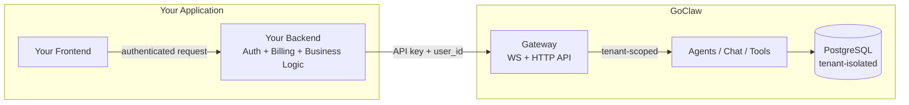
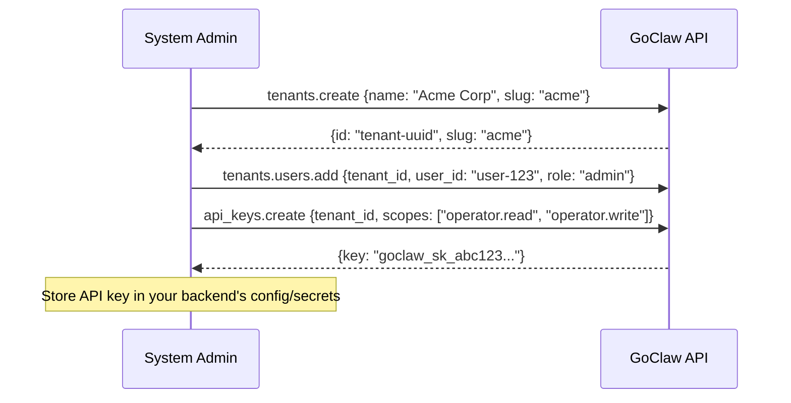
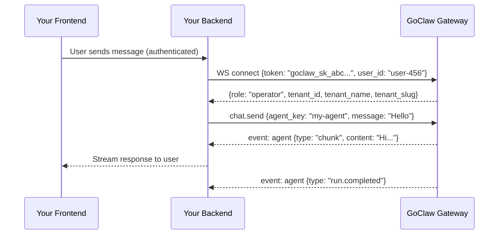
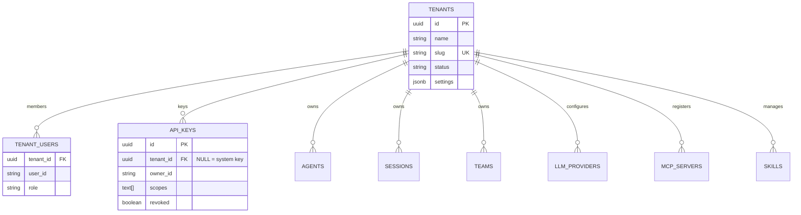

# Multi-Tenant Integration Guide

GoClaw is a **pure AI backend** — it handles agents, chat, sessions, tools, MCP servers, and memory. It does **not** handle user authentication, billing, or onboarding. Your application owns those concerns. API keys bridge the two systems.

This guide explains how to integrate GoClaw as a multi-tenant AI backend for your SaaS application.

---

## How It Works



Your **frontend never talks to GoClaw directly**. All requests go through **your backend**, which authenticates the user, then calls GoClaw using a **tenant-bound API key**. The API key stays server-side — never exposed to the browser.

GoClaw automatically scopes all data — agents, sessions, memory, teams — to the tenant bound to that API key.

**Single-tenant mode** works unchanged. All data lives under a default "master" tenant. Multi-tenant features activate only when you create additional tenants.

---

## Tenant Setup



Each tenant gets isolated: **agents, sessions, teams, memory, LLM providers, MCP servers, skills**. A tenant-bound API key automatically scopes every request — no extra headers needed.

---

## Tenant Resolution

GoClaw determines the tenant from the credentials used to connect:

| Credential | Tenant Resolution | Use Case |
|------------|-------------------|----------|
| **API key** (tenant-bound) | Auto from key's `tenant_id` | Normal SaaS integration |
| **API key** (system-level) + `X-GoClaw-Tenant-Id` header | Header value (UUID or slug) | Cross-tenant admin tools |
| **Gateway token** + `X-GoClaw-Tenant-Id` header | Header value (UUID or slug) | System owner scoping |
| **Gateway token** (no header) | All tenants (cross-tenant) | System administration |
| **No credentials** | Master tenant | Dev/single-user mode |

**Recommended**: Use **tenant-bound API keys** for integration. The tenant is resolved automatically from the key — your backend doesn't need to send any tenant header.

---

## HTTP API

All HTTP endpoints accept standard headers:

| Header | Required | Description |
|--------|:---:|-------------|
| `Authorization` | Yes | `Bearer <api-key-or-gateway-token>` |
| `X-GoClaw-User-Id` | Yes | Your app's user ID (max 255 chars). Scopes sessions and per-user data |
| `X-GoClaw-Tenant-Id` | No | Tenant UUID or slug. Only needed for system-level keys |
| `X-GoClaw-Agent-Id` | No | Target agent ID (alternative to `model` field) |
| `Accept-Language` | No | Locale for error messages: `en`, `vi`, `zh` |

**Example** — Your backend sends a chat request on behalf of a user:

```bash
# Called from YOUR backend, not from the browser
curl -X POST https://goclaw.example.com/v1/chat/completions \
  -H "Authorization: Bearer goclaw_sk_abc123..." \
  -H "X-GoClaw-User-Id: user-456" \
  -H "Content-Type: application/json" \
  -d '{"model": "agent:my-agent", "messages": [{"role": "user", "content": "Hello"}]}'
```

The API key is bound to tenant "Acme Corp" — the response only includes data from that tenant. No `X-GoClaw-Tenant-Id` header needed.

**Example** — System admin listing agents for a specific tenant:

```bash
curl https://goclaw.example.com/v1/agents \
  -H "Authorization: Bearer $GATEWAY_TOKEN" \
  -H "X-GoClaw-Tenant-Id: acme" \
  -H "X-GoClaw-User-Id: admin-user"
```

---

## WebSocket Integration

For real-time features (streaming chat, live events), your backend connects to GoClaw via WebSocket:



After `connect`, **all methods are auto-scoped** to the API key's tenant. Events are server-side filtered — your backend only receives events belonging to its tenant.

**Protocol**: Frame types `req` (client→server), `res` (server→client), `event` (async push). Protocol version 3.

---

## Chat Channels

Chat channels (Telegram, Discord, Zalo, Slack, WhatsApp, Feishu) connect to GoClaw as **channel instances**. Each instance is configured with a `tenant_id` — messages from that channel are automatically resolved to the correct tenant.

No API key or header is needed for channel-based interactions. The tenant is determined by the channel instance configuration at setup time.

---

## API Key Scopes

API keys use scopes to control access level:

| Scope | Role | Permissions |
|-------|------|-------------|
| `operator.admin` | admin | Full access — agents, config, API keys, tenants |
| `operator.read` | viewer | Read-only — list agents, sessions, configs |
| `operator.write` | operator | Read + write — chat, create sessions, manage agents |
| `operator.approvals` | operator | Approve/reject execution requests |
| `operator.provision` | operator | Create tenants + manage tenant users |
| `operator.pairing` | operator | Manage device pairing |

A key with `["operator.read", "operator.write"]` gets `operator` role. A key with `["operator.admin"]` gets `admin` role.

---

## Security

| Concern | How GoClaw Handles It |
|---------|-----------------------|
| API key exposure | Keys stay in your backend — never sent to browser |
| Cross-tenant data access | All SQL queries include `WHERE tenant_id = $N` |
| Event leakage | Server-side filtering — events only reach matching tenant |
| Missing tenant context | Fail-closed: returns error, never unfiltered data |
| API key storage | Keys hashed with SHA-256 at rest; only prefix shown in UI |
| Tenant impersonation | Tenant resolved from API key binding, not client headers |
| Privilege escalation | Role derived from key scopes, not client claims |

---

## Tenant Data Model



40+ tables carry `tenant_id` with NOT NULL constraint. Exception: `api_keys.tenant_id` is nullable — NULL means system-level cross-tenant key.

**Master tenant** (UUID `0193a5b0-7000-7000-8000-000000000001`): All legacy/default data. Single-tenant deployments use this exclusively.
